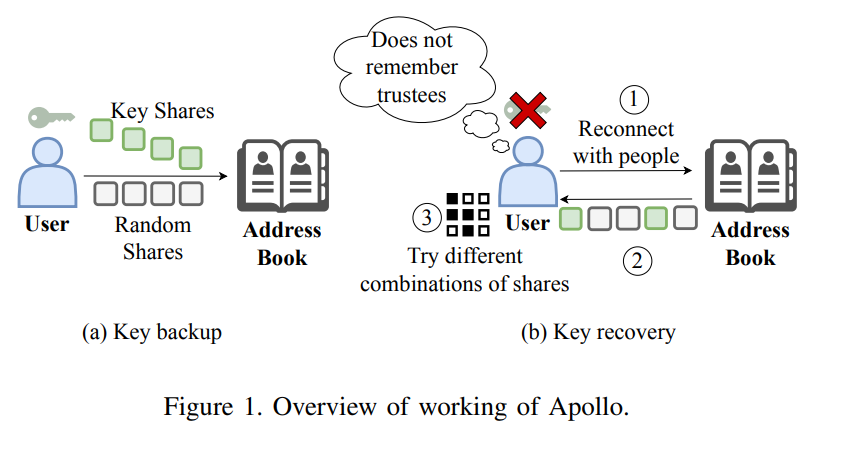
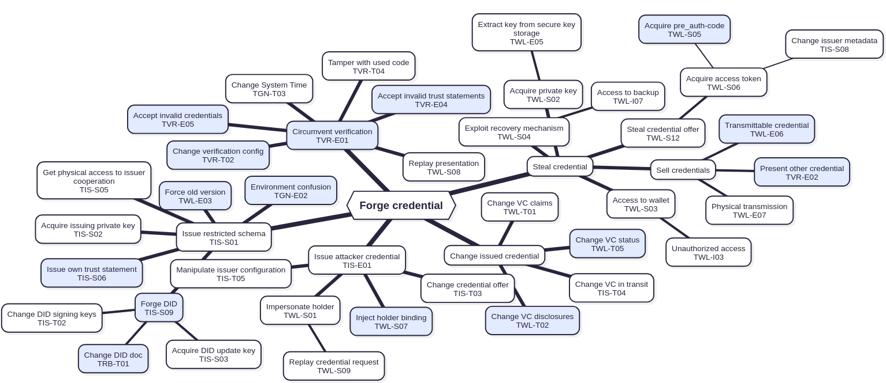
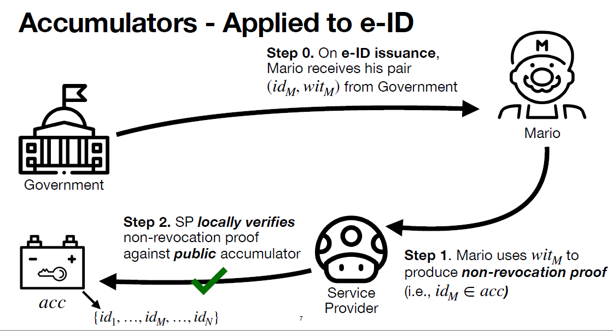
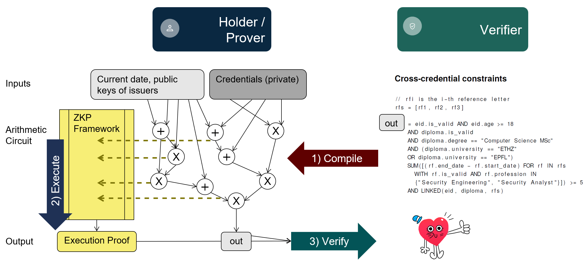
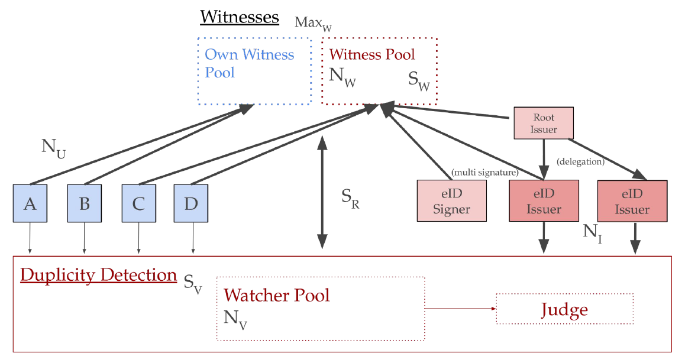
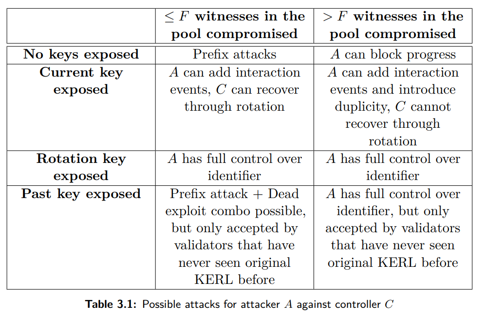

# Introduction
This page provides an overview of our reseach activities in the area of self-sovereign-identity (SSI). Real-world applications of the SSI paradigm include the [Swiss e-ID](https://www.eid.admin.ch) and the European [EUDI](https://eudi.dev).

# Social Vault Recovery

Social key recovery mechanisms enable users to recover their vaults with the help of trusted contacts, or trustees,
avoiding the need for a single point of trust or memorizing complex strings. However, existing mechanisms overlook the
memorability demands on users for recovery, such as the need to recall a threshold number of trustees. Therefore, we first
formalize the notion of recovery metadata in the context of social key recovery, illustrating the tradeoff between easing
the burden of memorizing the metadata and maintaining metadata privacy. We present Apollo, the first framework
that addresses this tradeoff by distributing indistinguishable data within a user’s social circle, where trustees hold relevant
data and non-trustees store random data. Apollo eliminates the need to memorize recovery metadata since a user eventually
gathers sufficient data from her social circle for recovery. Due to indistinguishability, Apollo protects metadata privacy by
forming an anonymity set that hides the trustees among non-trustees. To make the anonymity set scalable, Apollo proposes
a novel multi-layered secret sharing scheme that mitigates the overhead due to the random data distributed among non-trustees. 

[Full report...](https://arxiv.org/abs/2507.19484)

# Security Testing 

## SWIYU Infrastructure

This thesis conducts a rigorous security analysis of the Swiss trust infrastructure.
In particular, we develop a threat model for each component of the ecosystem and attack
trees for the most essential security goals. The attack trees are then used to guide the source code
analysis for vulnerability detection. Although the European Union is currently working on a similar
project, to our knowledge, there have been no noteworthy research studies that have performed
systematic security analysis of such nationwide SSI implementations with a centralised registry. We
found more than 90 vulnerabilities and supported their remediation in direct collaboration with the
development team. More than half of our findings have already been fixed or accepted for public
beta. The development team is currently working on the other, still open, findings. This thesis makes
a direct contribution to enhancing the security of the upcoming Swiss e-ID.

* [Full report...](https://github.com/user-attachments/files/21157739/Security_Analysis_of_the_Swiss_e_ID___Trust_Infrastructure.pdf)
* [Presentation in public e-ID participation meeting from July 2025 (YouTube)](https://youtu.be/ASgnpElZsk0?si=IzKH53iatFxuzroD&t=2663)

# Privacy Preservation

## Revocation of Credentials

Verifiable credentials allow holders to selectively disclose the information
they wish to share, and ensure that subsequent disclosures remain
unlinkable.
In certain circumstances, governments may need to revoke some e-ID
credentials, such as when the credential’s hosting device is lost or stolen,
in cases of criminal prosecution, or if the security of the issuer has been
compromised. Popular list-based revocations approaches are not privacy-preserving,
as they require the disclosure of unique identifiers, while unlinkable
approaches are not practical enough for adoption in e-ID systems.
In this thesis, we address the challenge of revoking verifiable credentials
by proposing a privacy-preserving revocation scheme based on cryptographic
accumulators, designed to be scalable for national e-ID systems. The scalability
of the proposed scheme is not limited to the Swiss e-ID instance
but could also be extended to multi-national e-ID systems, such as those in
the European Union.

[Full report and sourceode...](https://github.com/alecolo129/eid-revocation-rs)

## Presentation of Credentials

In this thesis, we study the feasibility of
implementing flexible, privacy-preserving verification logic for anonymous
credentials using general-purpose zero-knowledge proofs. We
provide an overview, comparison, and performance analysis of state-of-
the-art zero-knowledge frameworks, and we design flexible credential
verification logic using arithmetic circuits. We then implement a
proof-of-concept framework for anonymous credentials based on zk-
SNARKs and integrate it into the Swiss e-ID infrastructure. Our work
highlights the flexibility of this approach, for example, we can seamlessly
prove properties of values that were computed, or aggregated,
from claims of multiple linked credentials. We also uncover issues and
limitations of current zero-knowledge frameworks, especially regarding
performance. For these, we indicate possible ways in which they
could be addressed by future work. We show that this approach is
practical with current technologies for reasonably complex statements,
such as validating a credential, while future research is very likely to
allow for much more complex verification logic.

[Full report and sourceode...](https://github.com/mombelld/general-purpose-zkps-vcs)

# Distributed Key and Trust Management

## KERI: A Use-Case Study for the Swiss e-ID

This thesis presents an overview and an analysis of the distributed key
management system KERI (Key Event Receipt Infrastructure) and its
ecosystem with a focus on security and scalability. With the goal of
providing the basis for a digital identity system for Switzerland, a KERI
Network model is proposed and analyzed. The model is run on a large
network of up to 10’000 users, the first time KERI has been tested at
this scale. By using the keriox rust library we also contributed to its
development. The final recommendation is that KERI is not suitable for
the use in the Swiss e-ID base registry.

[Full report and sourcecode...](https://github.com/luffa99/KERI-Under-Scrutiny-Master-Thesis/)

## KERI: A Security Analysis

This work describes KERI and analyzes the security
properties it provides to its users both in the role of controllers and of
validators. It provides insights on the inner functioning of KERI’s Algorithm for Witness Agreement (KAWA) and analyzes it in terms typically
associated with distributed consensus protocols. We also describe a way
to instantiate the validating side of the network based on the federated
voting process from the Stellar Consensus Protocol that can provide significant safety and liveness guarantees for validators. Finally, we explore
the possibility of adopting KERI and its custom credential format ACDC
for the implementation of the Swiss e-ID system.
Our work shows KAWA provides sufficient security guarantees to honest
controllers, while the validating side needs the help of strong governance
and monitoring to protect validators from malicious actors. We also conclude that KERI, at the point it is today, is not suitable to be used within
the Swiss e-ID for reasons related to its high complexity and weak privacy
guarantees. Some of its ideas and philosophy can however be integrated
into the system to fulfill the requirements set by the Swiss federation.

[Full report...](https://doi.org/10.3929/ethz-b-000735690)

