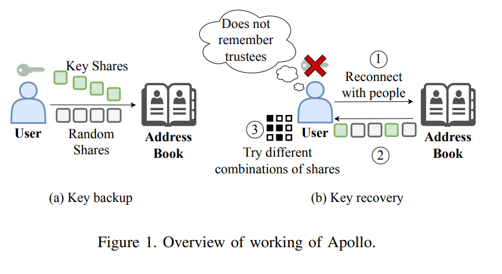
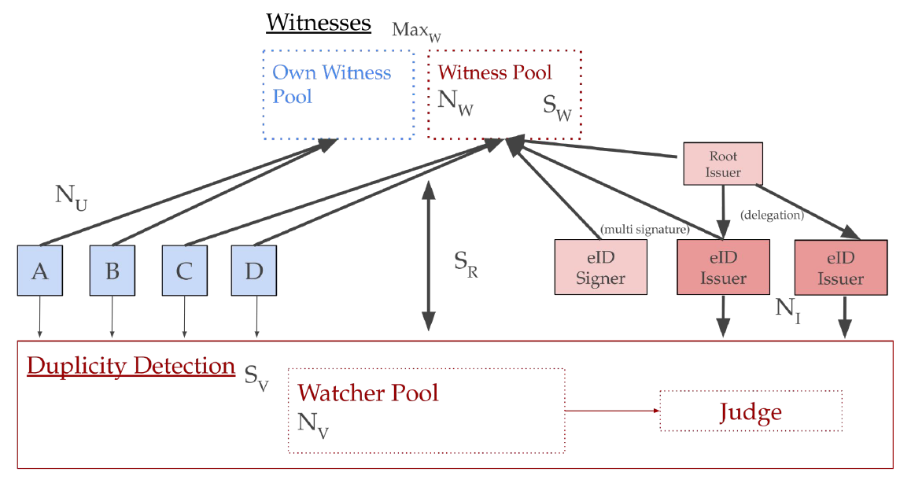

# Introduction
This repository presents research at the [Cyber-Defence Campus](https://www.cydcampus.admin.ch/en) on **self-sovereign identity (SSI)**, with a focus on building secure, privacy-preserving, and scalable digital identity systems. SSI shifts control over digital identities to users and underpins emerging real-world deployments such as the [Swiss e-ID](https://www.eid.admin.ch) and the European [EUDI](https://eudi.dev).

Our work covers important challenges across the SSI stack: key recovery for identity vaults, security testing of national e-ID infrastructures, privacy-preserving credential revocation and presentation, and distributed key and trust management. Several projects are evaluated at scale or directly applied to the Swiss e-ID ecosystem. Together, our efforts identify practical limitations of current approaches and inform the design of future national and cross-border digital identity systems.

## Contact
For questions, collaborations, or access to additional materials, please contact us through cydcampus@ar.admin.ch

# Security Testing 
Security testing involves threat modeling, creation of attack trees, and vulnerability analysis of the Swiss e-ID trust infrastructure.
We scrutinized the security of protocols, implementations and mobile platforms. 

| Title | Description | Links | 
| -------- | -------- | -------- |
| SWIYU Infrastructure | A rigorous security analysis of the Swiss trust infrastructure. | 📄 [Full report](https://github.com/user-attachments/files/21157739/Security_Analysis_of_the_Swiss_e_ID___Trust_Infrastructure.pdf),  ▶️ [Presentation in e-ID participation meeting (July 2025)](https://youtu.be/ASgnpElZsk0?si=IzKH53iatFxuzroD&t=2663) |
| SWIYU Wallet | Evaluation of the security of the Swiss e-ID mobile wallet (beta version), swiyu, with a specific focus on the Android platform.  | 📄 [Full report](https://github.com/cyber-defence-campus/self-sovereign-identity/blob/main/reports/Security_Analysis_of_Mobile_e_ID_Wallet_Applications-2025.pdf) |

# Privacy Preservation
Unlinkability of credential presentations is an important goal in the design of verifiable credential systems. That is, verifiers must not be
able to determine whether two anonymous credential presentations, e.g., proving legal age, belong to the same user or not. 
An even stronger notion of unlinkability retains anonymity of users even if issuers and verifiers collude to deanonymize presentations.
Achieving unlinkability is challenging, because static public keys, hashes, signatures or network metadata typically allow tracking of users across different credential presentations.

| Title | Description | Links | 
| -------- | -------- | -------- |
| Accountable Anonymity for National Digital Identity | We introduce the cryptographic forensic trail (CFT), a mechanism enabling controlled and transparent revocation of anonymity through a multi-party protocol with democratic checks and balances. | 📄 [Full report](https://eprint.iacr.org/2026/389), 📄 [Slides (PDF)](https://github.com/cyber-defence-campus/self-sovereign-identity/blob/main/reports/Frontdoors-not-Backdoors-Slides-2026-06.pdf) |
| Revocation of Credentials | We address the challenge of revoking verifiable credentials by proposing a privacy-preserving revocation scheme based on cryptographic accumulators, designed to be scalable for national e-ID systems. | 💻 [Full report and sourcecode](https://github.com/alecolo129/eid-revocation-rs) |
| Presentation of Credentials  | We study the feasibility of implementing flexible, privacy-preserving verification logic for anonymous credentials using general-purpose zero-knowledge proofs. | 💻 [Full report and sourcecode](https://github.com/mombelld/general-purpose-zkps-vcs) |

# Distributed Key and Trust Management
Key management is the foundation of secure distributed systems. Social key recovery mechanisms are studied and the *Apollo* framework for usable and privacy-preserving vault recovery is presented.
Moreover, [KERI](https://keri.one/) (Key Event Receipt Infrastructure), a fully decentralized identity system, is analyzed in terms of use cases and security. In KERI, keys are controlled by users and 
a system of witnesses and watchers enables users to manage trust in a distributed way.

## Social Vault Recovery with Apollo

Social key recovery mechanisms enable users to recover their vaults with the help of trusted contacts, or trustees,
avoiding the need for a single point of trust or memorizing complex strings. However, existing mechanisms overlook the
memorability demands on users for recovery, such as the need to recall a threshold number of trustees. Therefore, we first
formalize the notion of recovery metadata in the context of social key recovery, illustrating the tradeoff between easing
the burden of memorizing the metadata and maintaining metadata privacy. We present Apollo, the first framework
that addresses this tradeoff by distributing indistinguishable data within a user’s social circle, where trustees hold relevant
data and non-trustees store random data. Apollo eliminates the need to memorize recovery metadata since a user eventually
gathers sufficient data from her social circle for recovery. Due to indistinguishability, Apollo protects metadata privacy by
forming an anonymity set that hides the trustees among non-trustees. To make the anonymity set scalable, Apollo proposes
a novel multi-layered secret sharing scheme that mitigates the overhead due to the random data distributed among non-trustees. 

📄 [Full report](https://arxiv.org/abs/2507.19484)

## KERI: A Use-Case Study for the Swiss e-ID
<!--

-->

This thesis presents an overview and an analysis of the distributed key
management system KERI (Key Event Receipt Infrastructure) and its
ecosystem with a focus on security and scalability. With the goal of
providing the basis for a digital identity system for Switzerland, a KERI
Network model is proposed and analyzed. The model is run on a large
network of up to 10’000 users, the first time KERI has been tested at
this scale. By using the keriox rust library we also contributed to its
development. The final recommendation is that KERI is not suitable for
the use in the Swiss e-ID base registry.

📄💻 [Full report and sourcecode](https://github.com/luffa99/KERI-Under-Scrutiny-Master-Thesis/)

## KERI: A Security Analysis

This work describes KERI and analyzes the security
properties it provides to its users both in the role of controllers and of
validators. It provides insights on the inner functioning of KERI’s Algorithm for Witness Agreement (KAWA) and analyzes it in terms typically
associated with distributed consensus protocols. We also describe a way
to instantiate the validating side of the network based on the federated
voting process from the Stellar Consensus Protocol that can provide significant safety and liveness guarantees for validators. Finally, we explore
the possibility of adopting KERI and its custom credential format ACDC
for the implementation of the Swiss e-ID system.
Our work shows that KAWA provides sufficient security guarantees to honest
controllers, while the validating side needs the help of strong governance
and monitoring to protect validators from malicious actors. We also conclude that KERI, at the point it is today, is not suitable to be used within
the Swiss e-ID for reasons related to its high complexity and weak privacy
guarantees. Some of its ideas and philosophy can however be integrated
into the system to fulfill the requirements set by the Swiss federation.

📄 [Full report](https://doi.org/10.3929/ethz-b-000735690)

# Use Cases
National digital identity systems aim at providing an ecosystem of digital credentials, covering sector-specific use cases in health, finance, education, etc. We explore how the technology could be used to implement a security-critical credential: an electronic personnel security clearance  (e-PSP). 

## Proof-of-Concept for an Electronic Personnel Security Clearance (e-PSP)
Personnel Security Clearances (PSPs) are high-trust credentials vital to Swiss national security. Despite the comprehensive background checks and regulations they are based on, their real-life verification process is often lacking or vulnerable. The emergence of SWIYU, the Swiss national trust infrastructure, presents a timely opportunity to modernize this imperfect system by transitioning to verifiable digital credentials (e-PSPs) built upon hybrid Self-Sovereign Identity (SSI) principles.
The developed prototype can execute full credential lifecycles, covering issuance, revocation, and verification. The development and testing of the PoC also served as an active battle-test for SWIYU’s public beta, not only by generating actionable bug reports but by also being the first project to try multiple security-critical features in production.
Yet, a broader socio-technical assessment reveals that Switzerland is not immediately ready for the universal adoption of SWIYU-based e-PSPs. Resolving open legal and operational questions, clarifying organizational responsibilities, and lowering public skepticism towards the technology are important prerequisites. Nevertheless, these current blockers do not invalidate the general idea. This research provides the analytical and engineering foundations required once Switzerland is ready to transfer its high-security credentials to a new era.

📄 [Full report](https://www.utupub.fi/items/0f9e0f7a-7d16-4b64-88c2-c468e073c18c)

